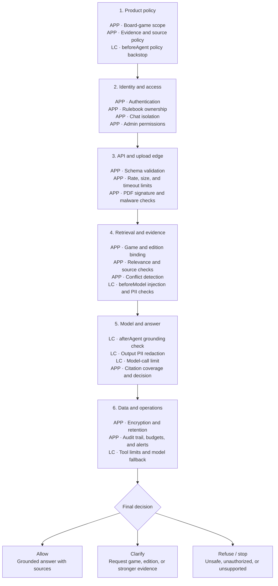

# RulesGuru Guardrail Architecture

**Status:** Proposed  
**Date:** 2026-07-16

## Purpose

RulesGuru uses layered guardrails to ensure that rules answers are authorized,
grounded in trustworthy evidence, safe to return, and operationally bounded.
Controls are applied from broad product policy down to concrete runtime and data
enforcement.

Guardrails have two owners:

- **Application:** Express middleware, application services, repositories, and
  infrastructure enforce controls outside the agent runtime.
- **LangChain:** Agent middleware enforces controls immediately before and after
  model execution.

LangChain middleware is defense in depth. It does not replace authentication,
upload validation, retrieval authorization, or database constraints.

## Top-to-Bottom Guardrail Flow

`APP` denotes an application-owned control. `LC` denotes LangChain middleware.

## Guardrail Layers

### 1. Product Policy

The product answers board-game rules questions, requires supporting evidence,
and abstains when evidence is missing or contradictory.

| Control              | Owner       | Expected behavior                                                                            |
| -------------------- | ----------- | -------------------------------------------------------------------------------------------- |
| Board-game scope     | Application | Reject unrelated requests before retrieval or model calls.                                   |
| Evidence required    | Application | Never generate a rules answer without accepted rulebook or public-source evidence.           |
| Public-source policy | Application | Restrict fallback search to reviewed domains and retain source provenance.                   |
| Policy backstop      | LangChain   | A `beforeAgent` guard prevents an agent invocation that bypasses the application classifier. |

### 2. Identity and Access

Authorization must be enforced before retrieving or mutating data. LangChain is
too late in the request lifecycle to provide this boundary.

| Control            | Owner       | Expected behavior                                                  |
| ------------------ | ----------- | ------------------------------------------------------------------ |
| Authentication     | Application | Resolve a trusted actor before accessing private state.            |
| Rulebook ownership | Application | Include ownership in repository and vector queries.                |
| Chat isolation     | Application | Only the owning actor can read, update, or delete a conversation.  |
| Admin permissions  | Application | Restrict shared-library publication and administrative operations. |

### 3. API and Upload Edge

Invalid or abusive input should be rejected before expensive parsing,
embedding, search, or model execution.

| Control                   | Owner       | Expected behavior                                                                              |
| ------------------------- | ----------- | ---------------------------------------------------------------------------------------------- |
| Request schemas           | Application | Reject unknown, malformed, oversized, or empty fields.                                         |
| Rate and quota limits     | Application | Bound requests, uploads, storage, and public-search usage per actor.                           |
| PDF verification          | Application | Verify the file signature and parseability rather than trusting extension and MIME type alone. |
| Malware scanning          | Application | Quarantine or reject suspicious uploaded files before ingestion.                               |
| Timeouts and cancellation | Application | Bound PDF parsing, embeddings, public search, and model calls.                                 |

### 4. Retrieval and Evidence

Retrieved PDF chunks and public-search results are untrusted data. They may be
irrelevant, conflicting, outdated, or contain prompt-injection text.

| Control                  | Owner       | Expected behavior                                                                                          |
| ------------------------ | ----------- | ---------------------------------------------------------------------------------------------------------- |
| Game and edition binding | Application | Search only the selected game and compatible edition/version.                                              |
| Relevance threshold      | Application | Clarify or abstain when no candidate meets the acceptance threshold.                                       |
| Trusted-domain allowlist | Application | Reject public results outside reviewed sources.                                                            |
| Conflict detection       | Application | Surface conflicting editions or sources instead of merging them silently.                                  |
| Prompt-injection scan    | LangChain   | A `beforeModel` guard treats retrieved instructions as data and blocks attempts to override system policy. |
| Input PII handling       | LangChain   | Redact, mask, hash, or block sensitive values before they reach the model.                                 |

### 5. Model and Answer

The final response must remain supported by the evidence that passed retrieval
guardrails.

| Control             | Owner       | Expected behavior                                                                               |
| ------------------- | ----------- | ----------------------------------------------------------------------------------------------- |
| Grounding check     | LangChain   | An `afterAgent` guard rejects unsupported assertions or converts the response to an abstention. |
| Output PII handling | LangChain   | Prevent sensitive values from leaking through answers, titles, or persisted messages.           |
| Model-call limit    | LangChain   | Bound calls per invocation and conversation thread.                                             |
| Citation coverage   | Application | Require material claims to map to returned source metadata.                                     |
| Decision contract   | Application | Return one explicit outcome: `allow`, `clarify`, or `refuse`.                                   |

### 6. Data and Operations

Operational controls limit damage when an upstream guard fails or a dependency
becomes unavailable.

| Control                  | Owner       | Expected behavior                                                                             |
| ------------------------ | ----------- | --------------------------------------------------------------------------------------------- |
| Encryption and retention | Application | Protect stored chats and PDFs and delete them according to policy.                            |
| Audit trail              | Application | Record guard decisions, reason codes, source IDs, model, and latency without logging secrets. |
| Cost budgets             | Application | Bound embedding, model, Tavily, and storage consumption.                                      |
| Metrics and alerts       | Application | Monitor refusals, low-relevance retrieval, injection attempts, timeouts, and guard failures.  |
| Tool-call limit          | LangChain   | Bound calls if agents gain tools in a later phase.                                            |
| Model fallback           | LangChain   | Use an approved fallback model only when policy allows it.                                    |
| Fail closed              | Both        | A guardrail error must not silently turn into an unguarded model call.                        |

## Current Coverage

The project already provides several deterministic controls:

- `RequestClassifierService` rejects clearly out-of-scope requests.
- Retrieval applies a relevance threshold before answer generation.
- Tavily supports a configurable domain allowlist.
- Zod validates HTTP request bodies.
- Multer enforces PDF extension, MIME type, and upload size.
- Production responses hide internal error details.
- Conversation history is bounded.
- Production rejects memory persistence.
- Failed ingestion cleans up partially written vectors.

Important remaining gaps include authentication, ownership-aware retrieval,
mandatory trusted public sources, real PDF signature and malware checks, prompt
injection detection, PII handling, grounded-output validation, rate limits,
timeouts, and guardrail audit events.

## Recommended Delivery Order

### Phase A: Trustworthy Answers

1. Make trusted public-source configuration mandatory when fallback is enabled.
2. Add a retrieval-evidence guard for injection patterns and conflicting
   sources.
3. Add an `afterAgent` grounding guard.
4. Add citation-coverage validation and explicit `allow | clarify | refuse`
   outcomes.

### Phase B: Privacy and Cost

1. Add LangChain PII middleware to agent input and output.
2. Add model-call limits.
3. Add API rate limits, provider timeouts, and cancellation.
4. Add redacted guardrail audit events and usage budgets.

### Phase C: Access and Upload Security

1. Add authentication and actor-aware repository contracts.
2. Enforce rulebook and chat ownership inside database queries.
3. Verify PDF signatures and parseability.
4. Add malware scanning and upload quarantine.

### Phase D: Operational Hardening

1. Define retention and deletion policies for chats, PDFs, and vectors.
2. Add dashboards and alerts for guardrail outcomes.
3. Add controlled model fallback.
4. Exercise fail-closed behavior with dependency-failure tests.

## LangChain Integration Point

The existing `createLangChainAgentRuntime(model)` factory should accept an
ordered middleware list and pass it to `createAgent`. Middleware should be
selected by agent responsibility:

- `RuleContextAgent`: input PII handling and retrieved-content injection checks.
- `RuleAnswerAgent`: model-call limits, output PII handling, and grounding checks.
- `ConversationTitleAgent`: input/output PII handling and a strict output-length
  validator.

Application services must continue to enforce policy before invoking these
agents.

Relevant LangChain documentation:

- [JavaScript guardrails](https://docs.langchain.com/oss/javascript/langchain/guardrails)
- [Middleware overview](https://docs.langchain.com/oss/javascript/langchain/middleware/overview)
- [Prebuilt middleware](https://docs.langchain.com/oss/javascript/langchain/middleware/built-in)

## Testing Strategy

- Unit-test every deterministic guard with one accepted and one rejected case.
- Verify prompt-injection fixtures cannot alter system behavior.
- Verify unsupported answers become `clarify` or `refuse` responses.
- Verify PII strategies on user input, retrieved content, titles, answers, and
  persisted messages.
- Verify guard failures stop execution before the next expensive dependency.
- Verify authorization predicates are part of repository/vector queries.
- Track false-accept and false-refusal rates with a versioned evaluation set.
