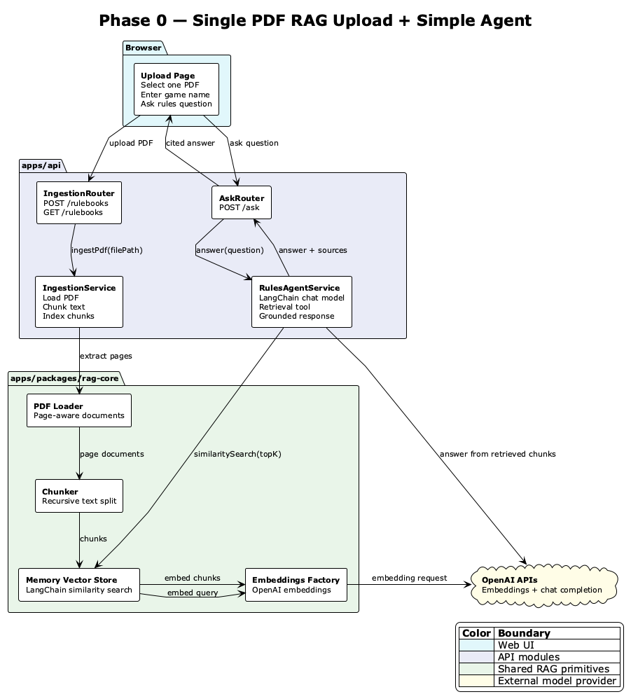

# Phase 0 Single PDF RAG Agent — High-Level Design

|            |            |
| ---------- | ---------- |
| **Status** | `DRAFT`    |
| **Date**   | 2026-07-07 |

---

## Problem Statement

Board Game Rules Assistant needs a small end-to-end RAG slice that proves the product loop: upload one rulebook PDF, index it, ask a rules question, retrieve similar rulebook chunks, and generate a grounded answer. The repo already has the upload and indexing foundation, but it does not yet expose a user-facing ask flow or a simple LangChain agent that calls retrieval before answering. Phase 0 should prioritize a resume-worthy, demoable path over production persistence.

## Current State

The current app has a React upload page, an Express API, and shared `rag-core` primitives. The web app posts a single PDF and game name to `POST /rulebooks`; the API validates the file with `multer`, stores it temporarily, extracts PDF text, chunks documents, embeds chunks through OpenAI, and upserts them into a LangChain-backed in-memory vector store. The API also supports listing and deleting in-memory rulebook records, but vector-store deletion and question answering are not implemented.

The in-memory vector store is process-local. Restarting the API loses indexed chunks, and deleting a rulebook only removes the UI/list record, not the stored vectors.

## Scope

**In Scope**

- Keep the Phase 0 UI focused on one PDF upload at a time.
- Store indexed chunks in the existing API process-local `LangchainMemoryVectorStore`.
- Add a simple ask UI below or beside the upload list after at least one rulebook is indexed.
- Add a minimal `POST /ask` API endpoint for natural-language questions.
- Add a `RulesAgentService` that uses LangChain with one retrieval tool backed by `VectorStore.similaritySearch`.
- Return an answer, top retrieved snippets, and source metadata sufficient to inspect why the answer was produced.
- Keep OpenAI as the embedding and chat model provider for Phase 0.

**Out of Scope**

- Persistent vector database such as Chroma, pgvector, Pinecone, or Qdrant.
- User accounts, tenant isolation, permissions, private/shared source separation, or paid rule packs.
- Multiple PDFs per answer with strong filtering.
- Citation verification, reranking, hybrid keyword search, eval harnesses, tracing UI, or full agent loop controls.
- OCR for scanned PDFs.
- Production-grade deletion from the vector store.

**Non-Goals**

- We are not optimizing for durable storage in Phase 0.
- We are not promising legally safe use of copyrighted uploaded rulebooks beyond local development.
- We are not building a general chat assistant; answers should stay constrained to retrieved rulebook context.
- We are not optimizing for sub-second answers.

**Assumptions**

- The API runs as a single local process during Phase 0 demos.
- `OPENAI_API_KEY` is available in `apps/api/.env`.
- Uploaded PDFs contain extractable text.
- One active user is enough for Phase 0.
- A simple top-k vector search is acceptable before adding reranking or hybrid search.

---

## Goals & Success Criteria

| Goal                                   | Success Metric                                     | Target                                                              |
| -------------------------------------- | -------------------------------------------------- | ------------------------------------------------------------------- |
| Prove end-to-end RAG loop              | Manual demo path completes without code changes    | Upload one PDF and answer one question in local dev                 |
| Ground answers in uploaded content     | Response includes retrieved source snippets        | At least 3 snippets returned for successful answers                 |
| Keep implementation portfolio-friendly | Clear module boundaries                            | Web, API, agent service, and `rag-core` responsibilities documented |
| Limit Phase 0 blast radius             | No new durable infrastructure                      | No database/vector DB dependency added                              |
| Preserve safe failure behavior         | Empty index or model failures produce typed errors | User sees actionable error instead of silent failure                |

---

## Recommended Solution

### Diagram Decision

- Diagram decision: create one lightweight flow diagram because the design spans the browser, API routers, ingestion service, `rag-core`, in-memory vector search, and OpenAI model calls.



[diagram source](./diagrams/phase-0-flow.puml)

### Description

Phase 0 should extend the current upload/indexing path instead of introducing a new backend shape. The API should continue constructing one shared `LangchainMemoryVectorStore` in `main.ts` and pass it to both `IngestionService` and the new `RulesAgentService`. This keeps ingestion and answering pointed at the same in-memory index.

The upload flow remains:

1. Web selects one PDF and enters a game name.
2. Web calls `POST /rulebooks`.
3. API validates the file and request body.
4. `IngestionService` loads PDF pages, chunks text, embeds chunks, and upserts them into the in-memory vector store.
5. API returns rulebook metadata and chunk counts.

The new ask flow should be:

1. Web enables an ask form once at least one rulebook is indexed.
2. Web calls `POST /ask` with `{ question, topK? }`.
3. `AskRouter` validates the request and calls `RulesAgentService.answerQuestion`.
4. `RulesAgentService` creates a simple LangChain agent or chain with a single retrieval tool.
5. The retrieval tool calls `vectorStore.similaritySearch({ query, topK })`.
6. The agent/chat model answers using only the retrieved chunks.
7. API returns `{ answer, sources }`, where each source includes snippet text and metadata such as page number/source where available.

The LangChain agent should stay intentionally bounded. For Phase 0, it can be a small tool-calling agent with one tool named `retrieve_rulebook_context`, or an equivalent retrieval-then-prompt chain if the agent API adds avoidable complexity. The key design requirement is that the model does not answer until retrieval has run.

Proposed API shape:

```http
POST /ask
Content-Type: application/json
```

```json
{
  "question": "Can I trade resources during another player's turn?",
  "topK": 4
}
```

```json
{
  "answer": "Based on the uploaded rulebook, ...",
  "sources": [
    {
      "text": "Trading section excerpt...",
      "score": null,
      "metadata": {
        "loc": { "pageNumber": 4 },
        "source": "catan-rulebook.pdf"
      }
    }
  ]
}
```

### Pros

- Builds directly on the existing upload and indexing pipeline.
- Keeps `rag-core` as the reusable RAG boundary instead of leaking LangChain implementation into the web app.
- Produces a complete local demo loop with minimal new infrastructure.
- Makes the future production path clearer: replace `LangchainMemoryVectorStore` with a durable vector-store adapter without rewriting the web ask flow.
- Keeps Phase 0 testable with unit tests around validation, retrieval behavior, empty-index handling, and prompt construction.

### Cons

- In-memory vector storage disappears on API restart.
- No true rulebook deletion from the vector store, so deleting a listed rulebook can leave chunks searchable until restart.
- No tenant/user isolation, so this design is not production-safe for multiple users.
- A single vector search may retrieve weak context for ambiguous questions.
- The simple agent may still hallucinate unless the prompt forces abstention when context is insufficient.

### Risks & Assumptions

| Risk/Assumption                           | Likelihood | Impact | Mitigation                                                                                                    |
| ----------------------------------------- | ---------- | ------ | ------------------------------------------------------------------------------------------------------------- |
| Uploaded PDF text extraction is poor      | Medium     | Medium | Surface extracted chunk count and answer with "not enough evidence" when retrieval is weak                    |
| Empty or stale in-memory index            | Medium     | Medium | Return `409 NO_RULEBOOK_INDEXED` when no chunks are available                                                 |
| Rulebook deletion does not remove vectors | High       | Medium | Document Phase 0 limitation; hide delete or warn that restart clears index until vector-store deletion exists |
| OpenAI API latency/cost affects demo      | Medium     | Medium | Keep `topK` low, cap question length, and set request timeout                                                 |
| Agent answers beyond retrieved evidence   | Medium     | High   | Use a strict system prompt and return sources; instruct abstention for missing evidence                       |
| Future production needs persistence       | High       | Medium | Keep a `VectorStore` interface so durable adapters can replace memory storage later                           |

### Dependencies

- `apps/web`: ask form and answer/source rendering.
- `apps/api`: new ask router, request/response schemas, agent service, OpenAPI update.
- `apps/packages/rag-core`: existing vector-store interface and LangChain memory adapter.
- OpenAI API key for embeddings and chat completion.
- Existing local dev scripts for running API and web.

### Estimate of Effort

| Size   | Confidence | Notes                                                                                                                  |
| ------ | ---------- | ---------------------------------------------------------------------------------------------------------------------- |
| Medium | Medium     | Upload/indexing already exists; remaining work is ask endpoint, LangChain answer service, web ask UI, tests, and docs. |

---

## Rollout Strategy

Ship behind a config-style local feature switch such as `ENABLE_ASK_ENDPOINT=true`, defaulting to enabled only for local development. Add the ask UI only when the API reports at least one indexed rulebook. Roll out in three small PRs:

1. API ask endpoint and `RulesAgentService` with manual curl validation.
2. Web ask form and answer/source rendering.
3. OpenAPI/docs updates and focused tests.

For Phase 0, production rollout is not recommended. This should be treated as a local demo and architecture learning slice.

## Rollback Plan

Rollback is low-risk because no durable data is introduced. Disable or remove the ask route/UI feature switch to return to upload-only behavior. If the in-memory index gets into a bad state during local testing, restart the API process to clear it. Expected time to recover is under five minutes.

## Testing & Validation Approach

- Unit test `RulesAgentService` with a fake `VectorStore` and fake chat model where possible.
- Unit test `AskRouter` request validation, empty question, oversized question, and empty-index response.
- Add API integration coverage for `POST /rulebooks` followed by `POST /ask` using a small fixture PDF when a test framework is added.
- Manually validate local demo flow with one text-based PDF:
  - upload succeeds,
  - chunks are indexed,
  - ask returns an answer,
  - sources include retrieved snippets,
  - impossible question abstains or says evidence is insufficient.
- Update OpenAPI with `POST /ask` request and response schemas.

## Open Questions

- [ ] Should Phase 0 ask across all uploaded PDFs in memory, or only the latest uploaded PDF?
- [ ] Should `topK` be user-configurable or fixed server-side?
- [ ] Which chat model should Phase 0 use by default?
- [ ] Should delete be hidden until vector-store deletion exists?

---

## Other Solutions Considered

### Do Nothing (Status Quo)

Keep upload and indexing only. This preserves the current simple app but does not prove the core product loop, because users cannot ask a question or see whether uploaded content improves answers.

### Direct Similarity Search Only

Add an endpoint that returns top matching chunks without an LLM answer. This would validate retrieval cheaply, but it is less compelling for a product demo and does not exercise prompt grounding or answer formatting.

### Durable Vector Database in Phase 0

Introduce Chroma, pgvector, Pinecone, or Qdrant immediately. This is closer to production, but it adds setup, deployment, deletion, schema, and operational decisions before the core RAG loop is proven.

### Full Agent Runtime

Build the larger agent loop with planning, retries, citation verification, tracing, and typed stop reasons now. This matches the long-term vision, but it is too much machinery for Phase 0 and would slow down the first demoable milestone.
