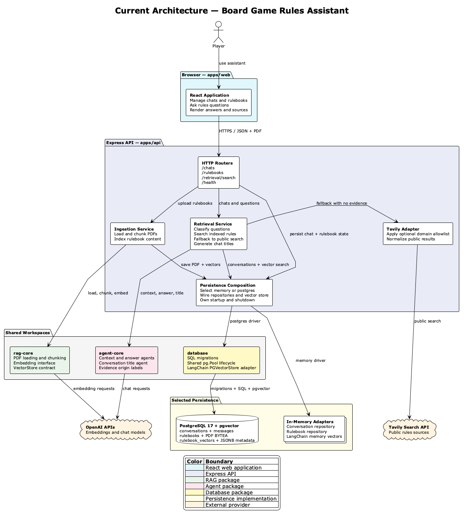
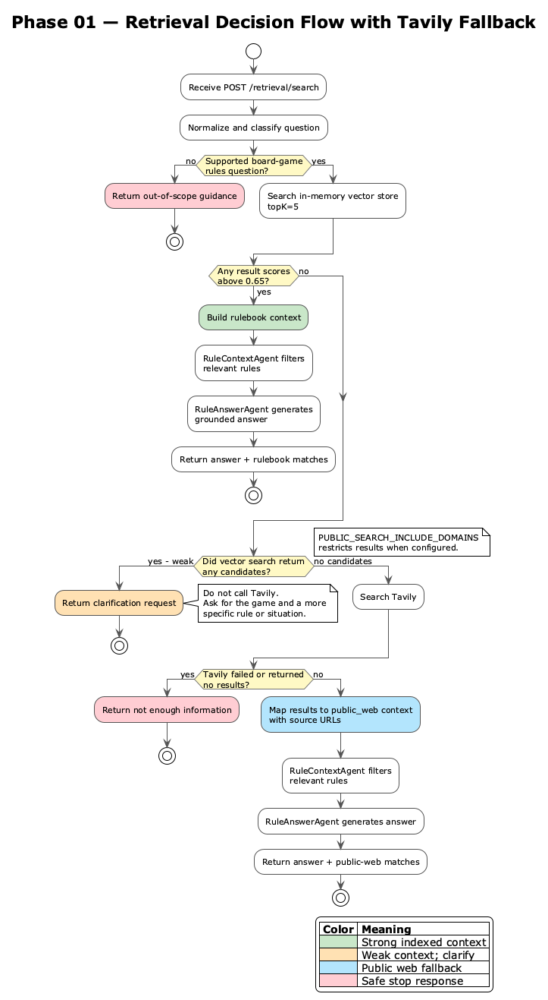

# Phase 01 Tavily Public Search — High-Level Design

|             |                                                           |
| ----------- | --------------------------------------------------------- |
| **Status**  | `IMPLEMENTED`                                             |
| **Date**    | 2026-07-11                                                |
| **Context** | Phase 01 retrieval fallback for missing rulebook evidence |

---

## Problem Statement

The Phase 0 assistant could answer only when its internal vector store returned
relevant uploaded rulebook chunks. A supported board-game question with no
matching indexed evidence therefore stops without trying an available public
source. Phase 01 adds a bounded Tavily fallback while keeping unrelated requests
out of scope and preserving the origin of every piece of evidence.

## Current State

The API exposes chat, rulebook, and retrieval endpoints. It classifies each
question, searches the selected vector store, and accepts rulebook matches whose
similarity score is greater than `0.65`. If candidates exist but all are weak,
the API asks the user to clarify rather than searching the web. Tavily is used
only when the vector store returns no candidates. Its results are labeled
`public_web`, passed through the existing context and answer agents, and returned
with source URLs.

Persistence is now selected at startup. Memory mode keeps conversations,
rulebooks, PDFs, and vectors process-local. PostgreSQL mode uses one shared pool,
versioned migrations, relational conversation and rulebook repositories, and
LangChain `PGVectorStore` over pgvector. The PostgreSQL rulebook table retains
original PDF bytes while the vector table stores searchable chunks and metadata.

The fallback is domain-restricted only when
`PUBLIC_SEARCH_INCLUDE_DOMAINS` is configured. Tavily scores and source authority
are not currently used as acceptance gates, so the implemented path is more
accurately described as public search with an optional trusted-domain allowlist.

## Scope

**In Scope**

- Reject clearly unrelated requests before internal or public retrieval.
- Search indexed rulebook chunks before using the internet.
- Ask for clarification when internal candidates exist but none exceed the
  relevance threshold.
- Use Tavily only when internal vector search returns no candidates.
- Support a configurable public-search domain allowlist.
- Preserve `rulebook` and `public_web` origin labels and source metadata.
- Reuse the same context-filtering and answer agents for both evidence origins.
- Stop safely when public search fails or returns no results.

**Out of Scope**

- Independent verification that a public source is official or authoritative.
- A Tavily-score threshold or cross-source corroboration.
- Per-rulebook privacy policy controlling whether internet fallback is allowed.
- LLM-generated or conversational clarification turns; Phase 01 returns a fixed
  clarification prompt.
- Retries, circuit breakers, caching, or provider failover.
- A machine-readable retrieval outcome in the HTTP response.

**Non-Goals**

- Phase 01 does not turn the product into a general web-answering assistant.
- Phase 01 does not treat public-web evidence as equivalent to an uploaded
  official rulebook.
- Phase 01 does not guarantee that an unrestricted Tavily result is reliable.

**Assumptions**

- Operators provide a valid `TAVILY_API_KEY`.
- Operators who require trusted-only search configure
  `PUBLIC_SEARCH_INCLUDE_DOMAINS` with reviewed domains.
- Tavily result content is sufficient for the context agent to filter for
  relevance.
- The fixed internal relevance threshold of `0.65` is acceptable for this
  prototype phase.

---

## Goals & Success Criteria

| Goal                                  | Success Metric                                     | Target |
| ------------------------------------- | -------------------------------------------------- | ------ |
| Preserve internal-first retrieval     | Tavily calls when vector search returns candidates | Zero   |
| Bound fallback to supported questions | Public searches for out-of-scope requests          | Zero   |
| Preserve evidence provenance          | Returned web matches with origin and source URL    | 100%   |
| Fail safely                           | Provider errors produce an ungrounded answer       | Zero   |
| Support trusted-domain operation      | Configured domains passed to Tavily                | 100%   |

## Recommended Solution

### Diagram Decision

- Diagram decision: use a full-system architecture diagram because the current
  flow spans the React client, Express HTTP and application layers, three shared
  packages, selectable persistence, and two external AI/search providers. The
  branch-level retrieval decision remains in the low-level design.

[PlantUML source](./diagrams/phase-01-system-architecture.puml)

### Description

The React web app uses the Express API to manage chats and rulebooks and to ask
rules questions. `IngestionRouter` and `IngestionService` load uploaded PDFs
through `rag-core`, generate OpenAI embeddings, and write chunks to the selected
vector store. The selected rulebook repository stores metadata and original PDF
bytes; PostgreSQL keeps them in a relational `rulebooks` table.

For questions, `RetrievalRouter` delegates to `RetrievalService`, which remains
the retrieval decision owner. It uses `RequestClassifierService` as the domain
guard, searches the same selected vector store used by ingestion, and treats
accepted indexed chunks as `rulebook` evidence. When internal evidence is
unavailable, it calls the provider-neutral `PublicSearchService`, implemented by
`TavilyPublicSearchService`.

The Tavily adapter applies the configured domain list and normalizes provider
results. Non-empty results become `public_web` evidence with source URLs. Both
rulebook and public-web evidence flow through `RuleContextAgent` and
`RuleAnswerAgent`, backed by the OpenAI chat model. Empty Tavily results or
provider errors stop without generating an answer from unsupported evidence.

This architecture separates ingestion, retrieval decisions, provider adapters,
answer generation, and persistence composition. `rag-core` owns storage-neutral
RAG contracts, `agent-core` owns model-facing agents, and the database package
owns PostgreSQL migrations, pool lifecycle, and the LangChain pgvector adapter.
Evidence provenance remains separate from generation: prompts distinguish
uploaded rules from potentially unofficial public content, while the web app
can render the source of each returned match.

### Pros

- Extends the existing retrieval path without changing the HTTP contract.
- Keeps Tavily behind a provider-neutral application interface.
- Preserves internal rulebook evidence as the first choice.
- Reuses the established context and answer agents.
- Returns public source URLs for inspection.
- Degrades safely when Tavily is unavailable.

### Cons

- Optional domain configuration means public search is not always trusted-only.
- A non-empty Tavily response is accepted regardless of score or authority.
- Clarification is a fixed response rather than a generated follow-up question.
- Search failure and no reliable result share the same user-facing outcome.
- A heuristic classifier requires maintenance as supported games and language
  expand.

### Risks & Assumptions

| Risk/Assumption                                        | Likelihood | Impact | Mitigation                                                                                                       |
| ------------------------------------------------------ | ---------- | ------ | ---------------------------------------------------------------------------------------------------------------- |
| Allowlist is unset                                     | Medium     | High   | Recommend reviewed domains in deployment configuration; make policy mandatory in the next reliability increment. |
| Tavily returns relevant-looking but unreliable content | Medium     | High   | Preserve `public_web` labels and source URLs; add score and authority gates next.                                |
| Broad classifier admits unrelated questions            | Medium     | Medium | Keep narrow rules and known-game tests; replace with indexed-game or model-backed classification later.          |
| Tavily is unavailable or rate-limited                  | Medium     | Medium | Catch provider errors and return no answer from public evidence.                                                 |
| Fixed vector threshold misroutes questions             | Medium     | Medium | Cover boundary behavior with tests and tune using retrieval evaluations.                                         |

### Dependencies

- `apps/api`: request classification, retrieval orchestration, configuration,
  and Tavily adapter.
- `apps/packages/rag-core`: vector-store interface and scored similarity search.
- `apps/packages/agent-core`: context-origin labels and answer agents.
- `apps/packages/database`: PostgreSQL migrations, connection-pool lifecycle,
  and the LangChain pgvector adapter.
- PostgreSQL 17 with pgvector when `PERSISTENCE_DRIVER=postgres`.
- Tavily API and `@langchain/tavily`.
- OpenAI chat model used by the context and answer agents.

### Estimate of Effort

| Size  | Confidence | Notes                                                                                                            |
| ----- | ---------- | ---------------------------------------------------------------------------------------------------------------- |
| Small | High       | Implemented as an additive API path with one external adapter, configuration, prompts, tests, and documentation. |

## Rollout Strategy

Configure `TAVILY_API_KEY` and, for trusted-only operation,
`PUBLIC_SEARCH_INCLUDE_DOMAINS` in each environment. Validate the internal path,
the allowed-domain fallback path, and the safe-stop path before enabling the
feature outside local development. Monitor provider errors and returned source
domains during early use.

## Rollback Plan

The Tavily feature remains a code-and-configuration rollback: remove or disable
the Tavily-backed service and restore the internal-only not-found behavior.
PostgreSQL conversations, rulebooks, PDFs, and vector rows are independent of
that fallback and require no rollback migration. Expected recovery time is under
one deployment cycle.

## Testing & Validation Approach

- Unit-test that out-of-scope requests call no retrieval dependency.
- Unit-test that strong rulebook matches skip Tavily and retain rulebook metadata.
- Unit-test that weak internal candidates request clarification and skip Tavily.
- Unit-test that empty internal retrieval invokes public search.
- Unit-test Tavily errors and empty results as safe-stop outcomes.
- Unit-test public result origin and source URL propagation.
- Unit-test configured include domains and request-specific overrides.
- Manually verify an allowed-domain result in local development with a real
  Tavily key.

## Open Questions

- [ ] Should `PUBLIC_SEARCH_INCLUDE_DOMAINS` become mandatory whenever public
      fallback is enabled?
- [ ] What minimum Tavily score should qualify as reliable evidence?
- [ ] Should only official publisher domains be accepted, or can reviewed
      community sources such as BoardGameGeek be included?
- [ ] Should clarification become a typed, conversational outcome instead of a
      fixed answer string?
- [ ] Should the response distinguish `search_unavailable` from
      `no_reliable_source`?

## Other Solutions Considered

### Do Nothing (Status Quo)

Keep retrieval limited to uploaded rulebooks. This maximizes source control but
returns no useful answer whenever a supported public rule question has not been
indexed locally.

### Unrestricted Public Search

Always search Tavily without domain restrictions. This is simpler to operate and
offers broader coverage, but it increases exposure to irrelevant, unofficial, or
low-quality sources and does not satisfy the trusted-source intent.

### Public Search Before Internal Retrieval

Search the web first and use internal chunks as a fallback. This may improve
coverage but undermines uploaded rulebooks as the authoritative source, adds
avoidable latency and cost, and can surface conflicting rules.

### LLM-Only Answering

Ask the chat model to answer from pretrained knowledge when internal retrieval
fails. This removes Tavily integration but provides no inspectable current source
and weakens grounding and abstention behavior.

## Detailed Design

See [low-level-design.md](./low-level-design.md) for implementation contracts,
mapping, configuration, error handling, and known gaps.

The branch-level retrieval flow is documented in the low-level design:

[Decision-flow PlantUML source](./diagrams/phase-01-retrieval-decision-flow.puml)
