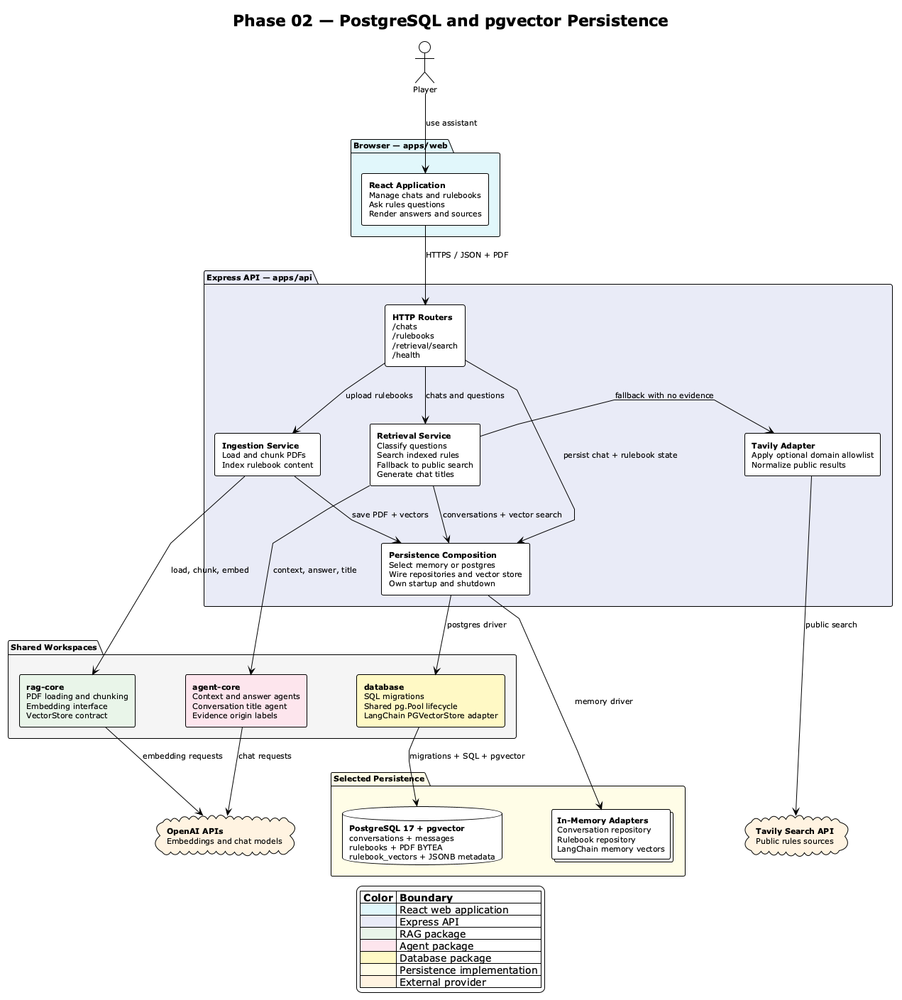

# Phase 02 PostgreSQL and pgvector Persistence — High-Level Design

|             |                                                                    |
| ----------- | ------------------------------------------------------------------ |
| **Status**  | `IMPLEMENTED`                                                      |
| **Date**    | 2026-07-14                                                         |
| **Context** | Durable chats, rulebooks, original PDFs, and vector-search content |

---

## Problem Statement

The earlier architecture kept chats, rulebook metadata, uploaded content, and
vectors inside the API process. Restarting the API lost that state, and the
in-memory vector implementation could not represent a production persistence
path. The application needed durable storage without coupling its application
services directly to PostgreSQL.

## Current State

The API selects a persistence driver at startup. Memory mode retains lightweight
process-local repositories and a LangChain memory vector store. PostgreSQL mode
uses one shared connection pool, ordered SQL migrations, relational repository
adapters, and LangChain `PGVectorStore` backed by pgvector.

PostgreSQL stores:

- conversations, generated titles, and bounded message history;
- rulebook metadata and original PDF bytes in `BYTEA`;
- rulebook chunks, embeddings, and JSONB metadata in `rulebook_vectors`.

The API waits for migrations and persistence health checks before listening and
closes the shared pool during graceful shutdown. `rag-core` remains
storage-neutral through its `VectorStore` contract.

## Scope

### In Scope

- Selectable `memory` and `postgres` persistence drivers.
- PostgreSQL 17 with the pgvector extension.
- A workspace database package for migrations, pool lifecycle, and the
  LangChain pgvector adapter.
- PostgreSQL repositories for conversations and rulebooks.
- Persistent original PDFs, chat messages, titles, vectors, and metadata.
- Docker Compose configuration for local PostgreSQL development.
- Exact cosine-similarity search through LangChain `PGVectorStore`.

### Out of Scope

- Authentication and per-user authorization.
- Vector deletion when a rulebook is deleted.
- Stable chunk identifiers, deduplication, or replacement semantics.
- Database-native metadata-filter expressions.
- HNSW or IVFFlat approximate indexes.
- Object storage for original PDFs.

## Recommended Solution

### Diagram Decision

Use a full-system dependency diagram because persistence affects the web-facing
workflows, API composition, all three shared workspaces, local memory adapters,
PostgreSQL/pgvector, and both external AI/search providers.

[PlantUML source](./diagrams/phase-02-system-architecture.puml)

### Description

The React application calls Express routers for chat management, rulebook
management, and retrieval. Ingestion loads and chunks PDFs through `rag-core`,
then writes original PDF data through the rulebook repository and searchable
chunks through the selected vector store.

Retrieval reads conversation context and performs vector search through the same
persistence composition. Accepted evidence flows through `agent-core` context
and answer agents. When indexed evidence is unavailable, the existing Phase 01
Tavily adapter remains the public-search fallback. OpenAI supplies embedding and
chat models.

The API composition root selects memory or PostgreSQL once during startup. In
PostgreSQL mode, `@board-game-rules-assistant/database` runs migrations,
initializes a shared `pg.Pool`, and adapts LangChain `PGVectorStore` to the
`rag-core` contract. API-owned PostgreSQL repositories share that pool for chat
and rulebook SQL operations.

## Key Decisions

| Decision                                               | Rationale                                                                                |
| ------------------------------------------------------ | ---------------------------------------------------------------------------------------- |
| One PostgreSQL database for relational and vector data | Keeps local operation and transactional data ownership simple.                           |
| LangChain `PGVectorStore`                              | Matches the existing LangChain vector abstraction and minimizes custom similarity SQL.   |
| Shared `pg.Pool`                                       | Avoids independent connection pools for vectors and repositories.                        |
| Versioned application migrations                       | Makes the relational schema repeatable and reviewable.                                   |
| Memory driver retained                                 | Keeps unit tests and lightweight local runs fast.                                        |
| Exact cosine search                                    | Avoids premature approximate-index tuning at the current scale.                          |
| PDF bytes in `BYTEA`                                   | Fits the current 40 MB upload limit and avoids introducing object storage in this phase. |

## Risks and Mitigations

| Risk                                                  | Impact                                                           | Mitigation                                                                                                                        |
| ----------------------------------------------------- | ---------------------------------------------------------------- | --------------------------------------------------------------------------------------------------------------------------------- |
| Append-oriented vector ingestion can duplicate chunks | Search quality and storage can degrade after repeated ingestion. | Add stable chunk IDs and replacement semantics in a later phase.                                                                  |
| Rulebook deletion does not remove vectors             | Deleted content may remain searchable.                           | Extend the vector contract with rulebook-scoped deletion before relying on deletion as a privacy boundary.                        |
| PDF `BYTEA` rows increase database size               | Backups and reads can become expensive at larger scale.          | Metadata list queries exclude PDF bytes; move binaries to object storage if scale requires it.                                    |
| Callback filters cannot execute in PostgreSQL         | Arbitrary memory filters are not portable.                       | Reject callback filters explicitly and design typed SQL metadata filters later.                                                   |
| LangChain owns the vector table shape                 | Schema evolution is partly coupled to the integration.           | Keep application tables migration-owned and migrate the vector table to an application-owned schema if richer joins are required. |

## Rollout Strategy

1. Start PostgreSQL through Docker Compose and wait for its health check.
2. Configure `PERSISTENCE_DRIVER=postgres` and `DATABASE_URL`.
3. Start the API; it runs migrations and verifies pgvector before listening.
4. Upload a rulebook, create a chat, ask a question, and restart the API.
5. Confirm the rulebook, chat history, PDF record, and vector search survive the
   restart.

Memory mode remains available as a rollback for local development. Production
configuration rejects the memory driver.

## Testing and Validation

- Run repository contracts against memory and PostgreSQL adapters.
- Run migration tests against a real pgvector container.
- Verify vector insertion, metadata round-tripping, and scored cosine search
  with deterministic embeddings.
- Verify driver configuration and production memory-mode rejection.
- Verify startup health checks and idempotent pool shutdown.
- Exercise upload, chat, retrieval, restart, and delete behavior through the API.

## Future Work

- Delete vector chunks atomically with their rulebook.
- Add stable chunk IDs and replacement semantics.
- Introduce typed metadata filters for authorized retrieval.
- Measure scale and recall before adding an approximate vector index.
- Move PDF binaries to object storage when database size or delivery patterns
  justify it.
